# National Data Dictionary User Guide

This user guide is at early version stage, and may be updated frequently in future.
___

## What is it for ? 
   
The NSIP Team at ESA has developed a prototype online data dictionary service intended to make it easier to mobilise data between different agencies and vendors, in order to realise better outcomes in the school sector, and to deliver high quality programmes. This reflects a growing use of data and IT students to inform and enrich education practice, and to enable evidence-based decision making. 

The definitions in the data dictionary will reflect a broad, national consensus, but individual formats and standards may involve different granularities or understandings of data, having been devised for different purposes. Critically, for the purpose of reconciling the potential subtle differences and uses of definitions between school authorities, the data dictionary definition will link to the different contexts that its elements turn up in, particularly in different data collections, and the different formulations of definitions in those contexts. For example, it should capture the different ways that authorities define schools and subschool entities, as a caveat for people working across authorities. In that way, users can have a more informed sense of the different ways that the elements the data dictionary aligns can be understood.

The data dictionary can also be used to enable privacy compliance, by identifying sensitive data elements transacted between agencies without restriction to a single data encoding. Facilitating data privacy compliance is a downstream benefit of the data dictionary, and its use to that end will be piloted. However, privacy classifications of data are specific to agencies, and the data dictionary will not impose a single privacy classification over its data definitions.
   
___

## Where is it ?

Home page: [data-dictionary.net](http://data-dictionary.net/)
___

## For normal user:

* ### **New user sign up with email verification**
  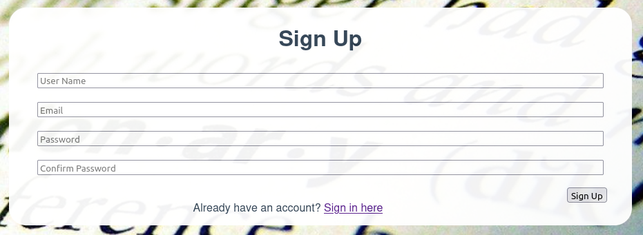   
  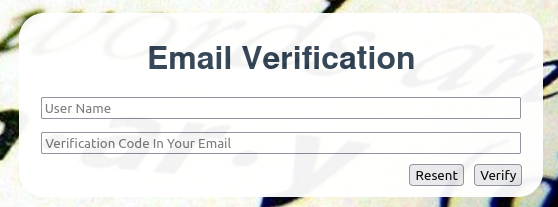

* ### **User sign in**  
  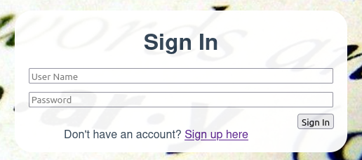

* ### **Auto ingest existing qualified dictionary json file**  
  For example, if dictionary item data as below json file and is in `./data/original/`, then it can be ingested into database automatically at startup.
```json
  {
  "Entity": "Campus",
  "OtherNames": [
    "Location"
  ],
  "Definition": "<p>A geographically distinct locations within a <A href='School'>school</A> from which education is offered... as distinct schools.</p>",
  "SIF": [
    {
      "XPath": [
        "/SchoolInfo"
      ],
      "Datestamp": "Latest version: 3.4.9, 2021-11-",
      "Definition": "This object contains information about the school or campus."
    }
  ],
  "OtherStandards": [
    {
      "Standard": "IMS One Roster",
      "Link": [],
      "Path": [
        "/School"
      ],
      "Definition": "",
      "Commentary": "The parent school for a campus ...
      ......
```
&emsp;&emsp;&ensp; Normal users can ignore this functionality.

* ### **List entities**   
     
  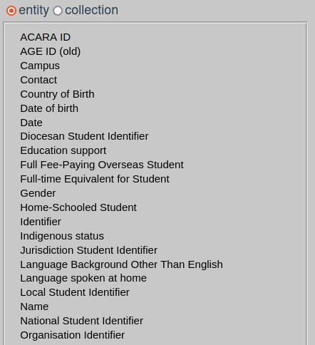   

* ### **List collections**   
     
  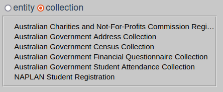   

* ### **Entity item clickable for content display**   

  e.g. **ACARA ID** is selected on left panel, the selected item name's font becomes **bold** and *italic*.   

  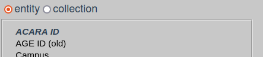  

  and **ACARA ID** content is displaying on right part.   

  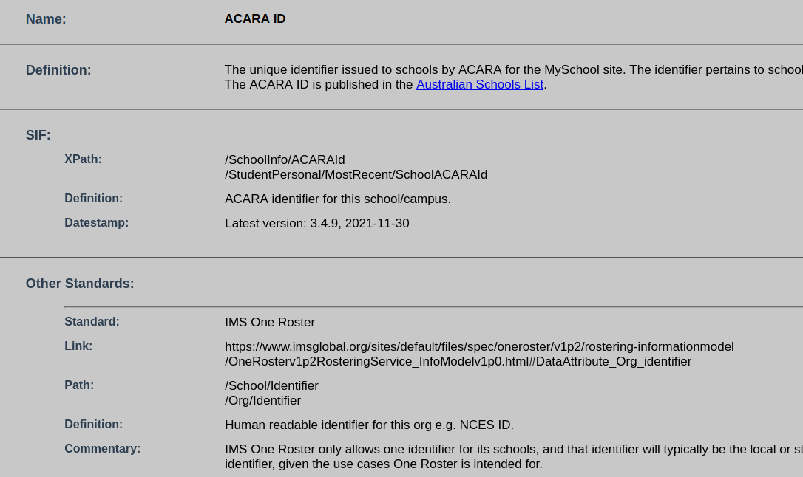  

* ### **Collection item clickable for content display**
  
  e.g. **Australian Government Address Collection** is selected on left panel, the selected item name's font becomes **bold** and *italic*.   

  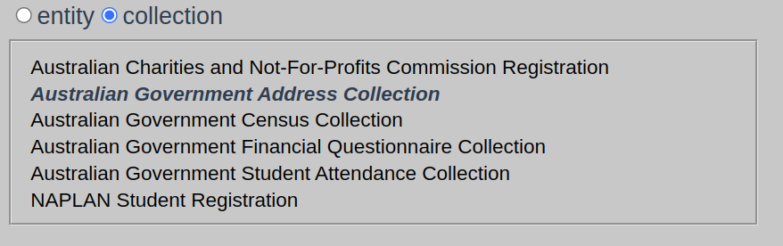   

  and **Australian Government Address Collection** content is displaying on right part.   

  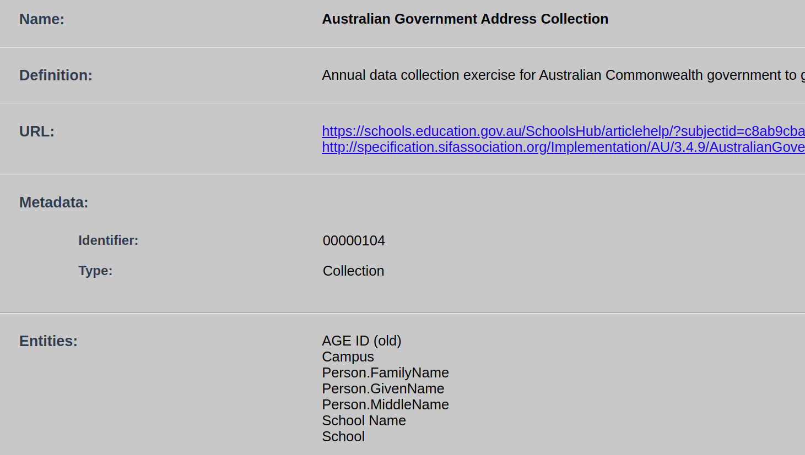  

* ### **Full text content search**
  
  e.g. We are looking for **'school'** from all items' content, and after searching, only those item which content has **'school'** are filtered.    
  
  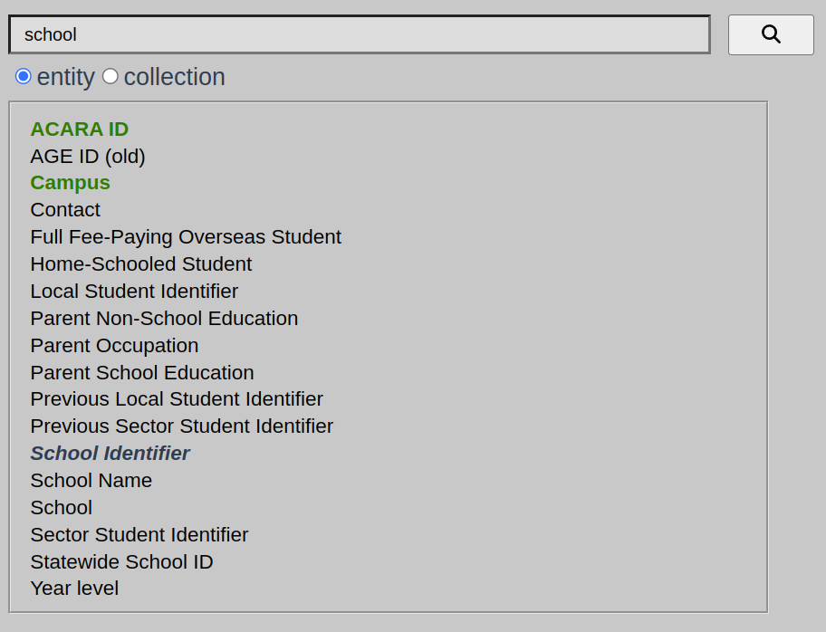  

* ### **Entities' hierarchy auto construction**. 
  
  Via entity's hierarchy, its ancestor, siblings & descendants can be clickable navigated.
  
  e.g. We selected **Student Identifier** from ***entity*** list, and its hierarchy path is automatically generated and shows its derived path as **Identifier** => **Person Identifier** => **Student Identifier**. Meanwhile, provides a list of sub classes which is derived from **Student Identifier**. All those path words are clickable for navigation.   

  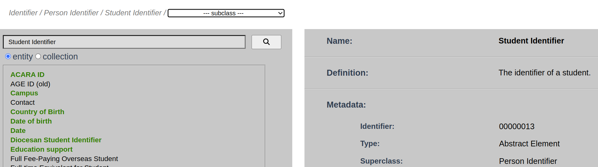  

* ### **Subscription**.   
  
  Any item in list panel can be subscribed/unsubscribed.   

  By toggle click   
     
  on the page's right bottom area, current selected item can be subscribed or unsubscribed.   

  Subscribed items in the list are marked as green **bold** font style, and the others are normal black font style. 
  
  e.g.   

  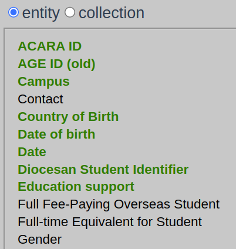

  Once your subscribed items are updated and approved by admin, your registered email will receive a notification to let you keep informed.


* ### **Create new entity or collection**
  
  If you want to do some contribution to data dictionary, you can create a new entity or collection by click   
     
  and then you could submit it to approval candidate list.

  Once you click this icon, you will be redirected to content entry page as below.

  If in your current *View Page* selected item type is *entity*, then page jumps into *New Entity Page*. i.e.
  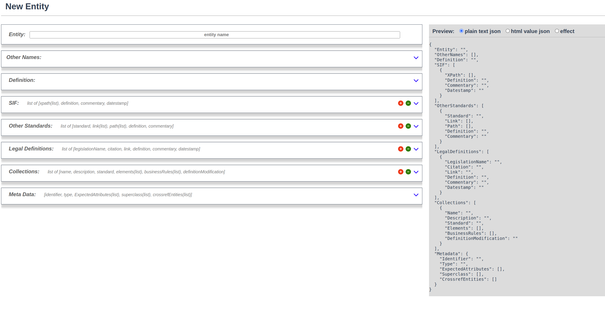   

  If in your current *View Page* selected item type is *collection*, then page jumps into *New Collection Page*. i.e.
  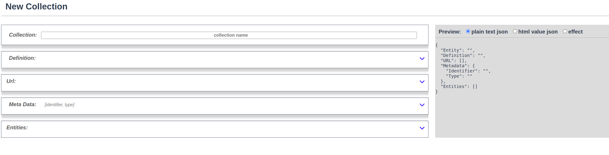   

  **New Page** consists of **left**, **right** areas. 

  **Left area** is text entry part. In this area, predefined fields for entity or collection with suitable inputs method are provided. e.g. ***'Item Name'*** value input is via simple text, ***'Other Names'*** value input is via multiple line text, and ***'Definition'*** value input is via richtext area. 

  **Right area** is preview part which provides 3 preview options: ***plain text json***, ***html value json*** and ***effect***.   
  * ***'plain text json'*** is that input entity/collection field's value is pure plain text.    
  * ***'html value json'*** is that input entity/collection field's value contains html format. i.e. those value may have html tags such as *'\<p>, \</p>'* etc.   
  * ***'effect'*** is data input effect on html render, which will be displayed on ***View Page*** content.
  
  Below is an example for new entity input on ***'plain text json'***, ***'html value json'*** and ***'effect'***:

  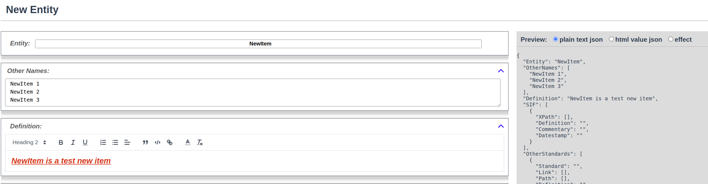 
  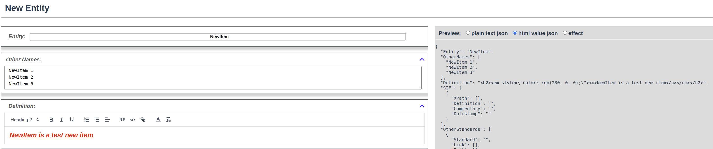 
  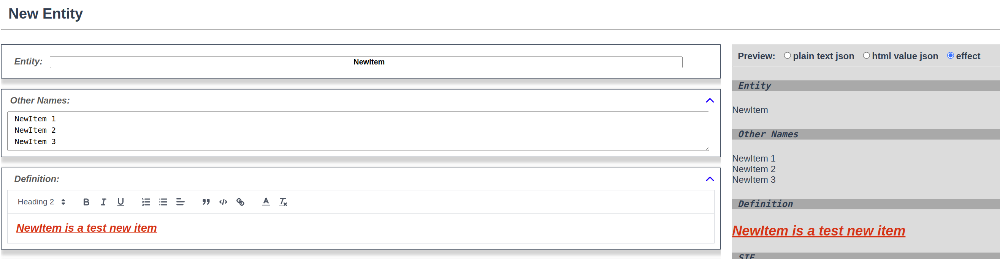 

  Once you finished your new entity/collection input, click   
  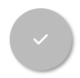   
  to submit your new entry item to wait for admin review.


* ### **Edit existing entity or collection**
  
  If you want to do some modification to data dictionary, you can edit an existing entity or collection by click   
     
  and then you could submit it to approval candidate list.

  Once you click this icon, you will be redirected to content edit page as below.

  If in your current *View Page* selected item type is *entity*, then page jumps into *Edit Entity Page*. e.g.
  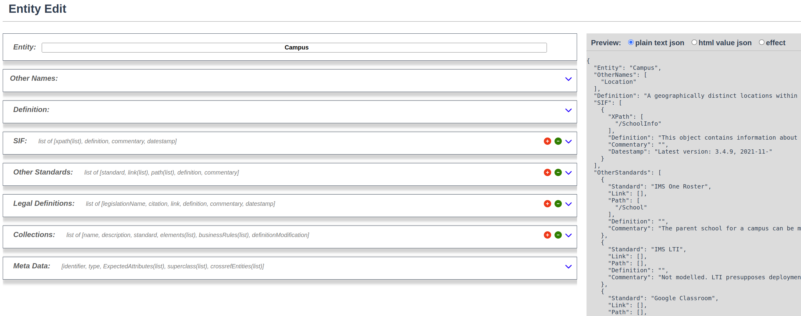   

  If in your current *View Page* selected item type is *collection*, then page jumps into *Edit Collection Page*. e.g.
  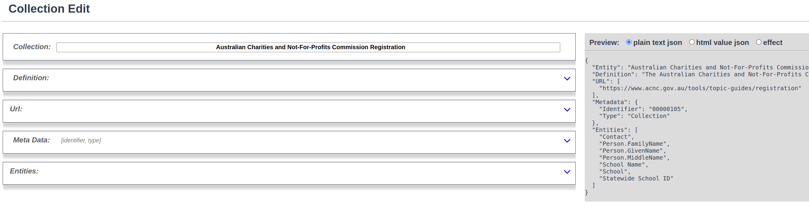  

  **Edit Page** also consists of **left** and **right** areas. Those functionalities are as the same as **New Page**
  
* ### **Logout**
  
  Click your login name shown on top right area, then popup logout confirm window.   
  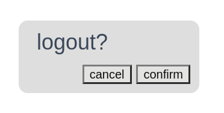  
  if logout confirmed, then jump back to login page.
___


## For Administrator:

  Apart from all functionalities provided to normal users, administrators are also provided 2 specific functionalities of **'approval'** and **'admin'**.   
  If you are admin role, on top right area of the **View Page**, those two specific options are shown.

  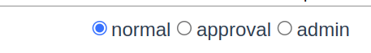  

  **[approval]**:

  Under this option, new or edited submission items are listed on the left side. It is also clickable and once clicked, its content is displayed on the main page. e.g. :   

  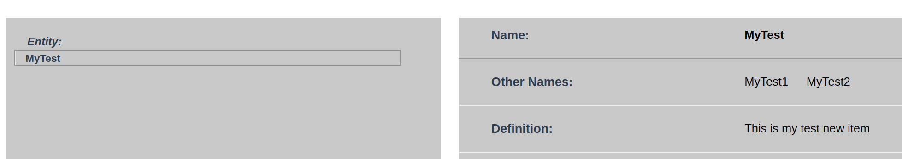  

  At the right bottom area, there is an approval button. 
  
  

  If clicked, which means current selected submitted item will be approved by current login administrator.    
  And this approved item will disappear from this candidate list in ***approval page*** and will appear in ***normal page*** left list. e.g. a new **'MyTest'** item appears at the bottom of left ***entity*** list.  

  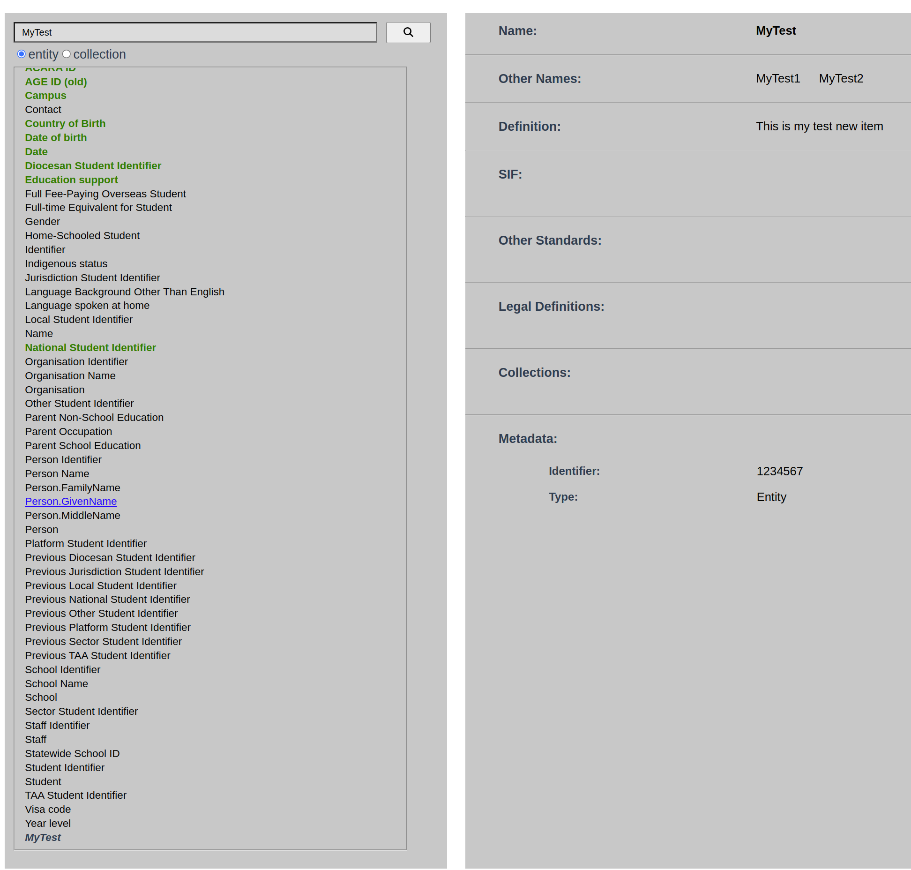

  Meanwhile, if a new item is approved, every registered user will receive a notification email saying ```"new item [MyTest] has been added into data dictionary"```.   

  If a existing item is approved by updating, its subscribed user will receive a notification email saying ```"data dictionary item [MyTest] has been updated"```.


  **[admin]**:
  
  Under this option, registered users are shown in a table as below: 

  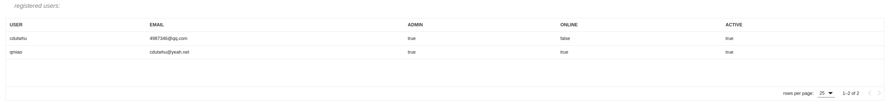  
  [user name], [user email], [admin status], [online status] and [active status] are displayed on this table.   
  Meanwhile, table row is clickable. e.g. user 'cdutwhu' row is clicked, then a popup window shows and some setting can be made from this window:

  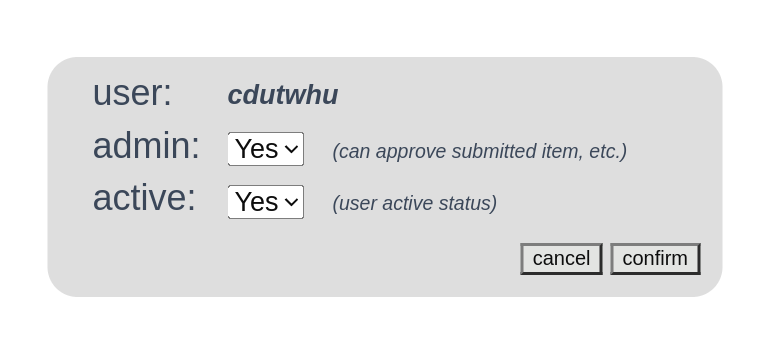  

  If an user's **admin** status is ***false***, then this user cannot do **approval** or **user admin**.    
  If an user's **active** status is ***false***, then this user cannot login Data Dictionary.
